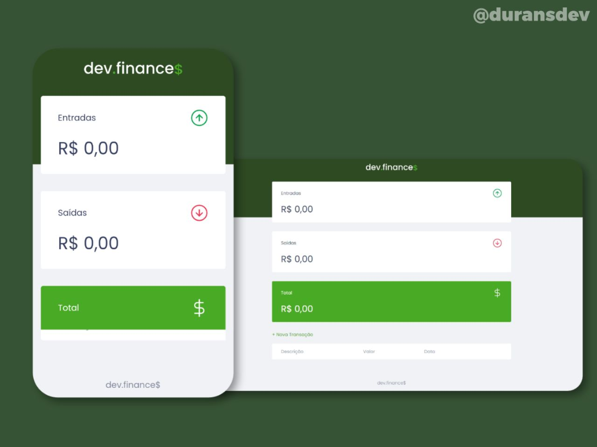

<h1 align="center">
  
</h1>

  Projeto desenvolvido na Maratona Discover da Rocketseat.

  <a href="#sobre-o-projeto">Sobre o projeto</a> |
  <a href="#tecnologias">Tecnologias</a>

<h2 id="sobre-o-projeto">Sobre o projeto</h2>

  O <em>dev.finance$</em> é uma aplicação para fazer o gerenciamento de suas finanças.

<h2 id="tecnologias">Tecnologias</h2>

- HTML
- CSS
- JavaScript